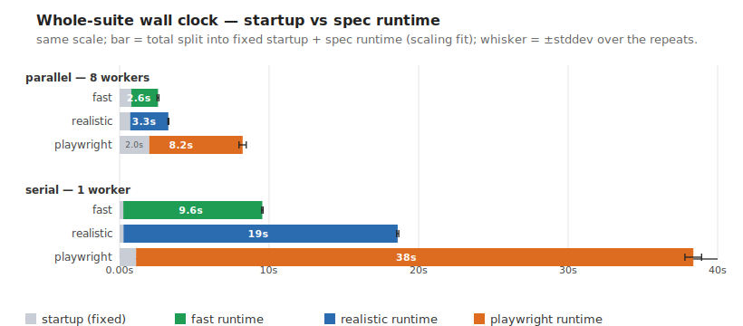
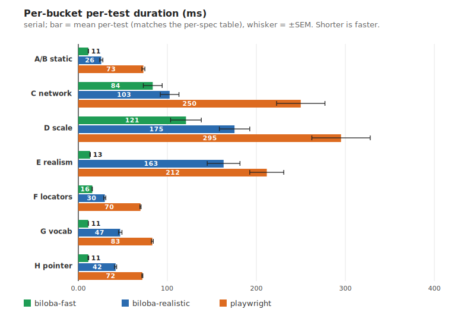
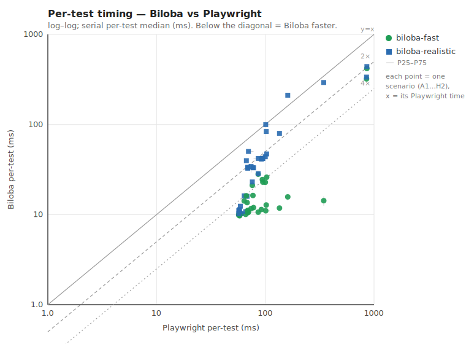

# Biloba vs Playwright — a performance comparison

A fair, reproducible **speed** comparison between
[Biloba](https://github.com/onsi/biloba) (Go, on chromedp) and
[Playwright Test](https://playwright.dev) (TypeScript/Node). One shared server, one
canonical scenario list implemented identically on every side, a framework-neutral
external stopwatch. The aim is to measure framework + runtime overhead for an
identical browser-test workload — not to manufacture a win. Read
[`METHODOLOGY.md`](./METHODOLOGY.md) for the fairness controls and threats-to-validity,
[`SCENARIOS.md`](./SCENARIOS.md) for the exact workload, and [`comparison.md`](./comparison.md)
for the full results.

> **Numbers below are from one machine** (Apple M1 Max, macOS, 8 performance cores),
> recorded 2026-06-15 — indicative, not universal. Run it yourself.

## The three configurations

Biloba 0.3.0 ships two interaction tracks, so this is a **three-way** comparison, and
the **identical 32-scenario suite runs under all three**:

| config | how interactions run | speed |
|---|---|---|
| **biloba-fast** | the default `b` — fast, atomic JavaScript simulations (`el.click()`, value-set, synthetic events). No scroll-into-view, occlusion check, or real pointer. | fastest |
| **biloba-realistic** | `b.Realistic()` — the *same tab*, with interactions routed through real Chrome DevTools Protocol input (scroll-into-view, real pointer moves, occlusion-aware clicks, real keystrokes). | middle |
| **Playwright** | its only model — always realistic (real CDP input, actionability waits). | baseline |

biloba-fast and biloba-realistic are the *same* Ginkgo suite: every interaction goes
through one handle that is either `b` or `b.Realistic()` (selected by an env var), so
**only the interaction engine differs** between the two runs.

**The fast ↔ realistic tradeoff is a speed-for-fidelity dial.** Fast skips the
per-interaction CDP round-trips, so it's ~2× faster than realistic (serial) — use it
for the bulk of a suite. Realistic matches Playwright's input fidelity (real pointer,
real keys, scroll, occlusion) for the handful of tests that need it — and, as the
numbers show, still runs ~2× faster than Playwright whole-suite.

## Topline — whole-suite wall clock (8 workers, n=15)

| config | parallel(8) | serial(1) | vs Playwright (parallel / serial) |
|---|---:|---:|---|
| **biloba-fast** | **2.57s** | **9.55s** | **3.2× / 4.0×** |
| **biloba-realistic** | **3.26s** | **18.60s** | **2.5× / 2.1×** |
| **playwright** | 8.23s | 38.37s | — |

Each bar below splits the total into **fixed startup** (Biloba shares one Chrome; Playwright
launches one browser per worker) and **spec runtime**, with ±stddev error bars:



- biloba-fast is **3.2× faster parallel / 4.0× serial** than Playwright.
- biloba-realistic — doing the *same* real-CDP-input work Playwright does — is still
  **~2.5× faster parallel / ~2.1× serial**.
- Realism costs **1.27× parallel / 1.95× serial** over fast: the price of real input.

## By category — the same three configs, per bucket

Serial **marginal per-spec** (each config's fixed startup is fit and subtracted, so a small
focused bucket isn't startup-dominated). This shows how the gap behaves as the work gets heavier.

| bucket | biloba-fast | biloba-realistic | playwright | pw/fast | pw/real |
|---|---:|---:|---:|---:|---:|
| A/B static (reads) | 10.3 ms | 24.4 ms | 80.0 ms | **7.8×** | 3.3× |
| C network | 86.1 ms | 106.9 ms | 259.8 ms | 3.0× | 2.4× |
| D scale | 124.0 ms | 180.4 ms | 306.3 ms | **2.5×** | 1.7× |
| F semantic locators | 14.4 ms | 29.5 ms | 81.2 ms | 5.6× | 2.8× |
| G interaction vocabulary | 10.2 ms | 47.4 ms | 90.7 ms | 8.9× | 1.9× |
| H pointer options | 10.0 ms | 42.2 ms | 82.0 ms | 8.2× | 1.9× |
| E realism (occlusion/scroll) | 11.1 ms | 165.4 ms | 235.2 ms | 21.2× | 1.4× |



- biloba-fast's lead is **widest (~8×) on trivial DOM** — almost pure framework overhead —
  and **compresses to ~2.5×** once real browser work dominates (D scale), where both run on
  the same Chromium engine.
- biloba-realistic tracks **~2× faster than Playwright** wherever it does real input, and
  **converges toward it on the heaviest work** (D 1.7×) where both are engine-bound.
- **E realism** is the outlier: biloba-fast is near-instant there because its atomic click
  *skips* the actionability wait (occlusion) and scroll that a real user needs; realistic
  does that work, landing next to Playwright. (Use realistic — or `BeClickable()` — when that
  actionability matters.)

## Per-test — every scenario, all three configs

Each scenario plotted as Biloba per-test (y) vs its Playwright per-test (x), log–log, with the
`y=x` diagonal and 2×/4× reference lines; below the diagonal = Biloba faster. ~25 serial samples
per point, P25–P75 error whiskers (small — per-test timing is stable).



biloba-fast (green) sits near/below the **4× line** and is roughly flat — its cheap atomic path
barely moves with how much work Playwright is doing. biloba-realistic (blue) hugs the **2× line** —
it scales *with* Playwright (both CDP-input-bound) but stays about twice as fast.

## The workload

32 scenarios across 7 buckets, replicated `REPS` times (default 8 → 256 specs/config). The same
assertions run on every config. Buckets get heavier left-to-right:

| bucket | tests | what they exercise | rough DOM |
|---|---:|---|---|
| **A/B static** | 10 | read-only DOM (count/visibility/text/attr/class/prop) + basic interactions (click counter, form fill, real-key typing) | trivial (~15 nodes) |
| **C network** | 5 | observe a real fetch, stub it, wait through 300 ms latency, abort it, modify the real response (CDP `Fetch`/`Network`) | trivial (~6 nodes) |
| **D scale** | 4 | render a **1000-row** table, filter a large list by real keys, drive a gated 4-step wizard, await staggered async appends | **heavy (~2000 nodes)** |
| **E realism** | 2 | an occluding overlay (cleared at 250 ms) and a button ~4000 px below the fold | trivial (~5 nodes) |
| **F semantic locators** | 3 | select by role+name / visible text / form label against **~200 distractor** roled elements (exercises the accessible-name engine) | medium (~600 nodes) |
| **G interaction vocabulary** | 6 | double / right / middle-click, drag-and-drop, wheel scroll, tap | trivial (~12 nodes) |
| **H pointer options** | 2 | click at an offset (`At`) and modifier-click (`Shift`) | trivial (~4 nodes) |

The Biloba suite also carries 3 fast-only CSS-hook variants of Bucket F (to measure the
CSS-vs-locator cost inside Biloba — the locator engine adds ~1.1×); they're excluded from the
headline by label.

## Running it

Prereqs: Go, Node ≥18, a one-time browser install on each side (`biloba/README.md`,
`playwright/README.md`). Then:

```bash
./run.sh                 # topline: all three configs, whole-suite wall clock
./scaling.sh             # startup vs marginal per-spec runtime (the fit behind the chart)
REPS=16 ./buckets.sh     # three-way per-bucket marginal per-spec
./pertest.sh             # per-test timing → charts/{scatter,buckets}.svg
```

The figures are SVGs under [`charts/`](./charts), generated by the stdlib-only Go tool there.
Layout: `server/` (shared Go target + fixtures), `biloba/` (Ginkgo suite), `playwright/`
(`@playwright/test` suite), `charts/` (SVG generator), and the run scripts.
